<!-- ═══════════════════════════════════════════════════════════════ -->
<!--              SANSKAR SRIVASTAVA — GITHUB PROFILE              -->
<!-- ═══════════════════════════════════════════════════════════════ -->

<div align="center">


<br/>


<br/><br/>

<a href="https://linkedin.com/in/sanskar-srivastava-3a551024"></a>
<a href="https://sanskar-srivastava-personal-data-analyst-portfoli.ai.studio"></a>
<a href="https://github.com/SANSKAR500"></a>

<br/><br/>


</div>

<br/>

<div align="center"></div>

<br/>

## 👨‍💻 About Me

```text
┌─────────────────────────────────────────────────────────────┐
│  👤 Sanskar Srivastava                                      │
│  🎯 Data Analyst | Business Analyst | Power BI Developer    │
│  🎓 B.Tech CSE — Chandigarh University (2022-2026)          │
│  📍 India                                                   │
│  🔬 Published Researcher in Cybersecurity                   │
│                                                             │
│  💡 "Good decisions come from good data.                    │
│      Great decisions come from great stories."              │
└─────────────────────────────────────────────────────────────┘
```

<br/>

## 🛠️ Tech Arsenal

<div align="center">

<h3>🖥️ Languages & Tools</h3>
<p></p>

<h3>📊 Analytics & Visualization</h3>
<p>


</p>

</div>

<br/>

## 📈 Core Competencies

<div align="center">
<table width="95%">
<tr>
<td width="33%" align="center">
### 📈 Business Intelligence
```text
KPI Analysis       ████████████████████░  95%
Dashboard Dev      ███████████████████░░░  92%
Data Storytelling  ███████████████████░░░  90%
ETL & Transform    ██████████████████░░░░  88%
Data Cleaning      ████████████████████░  93%
```
</td>
<td width="33%" align="center">
### 🔍 Data Analysis
```text
Exploratory DA     ████████████████████░  94%
Statistical An.    █████████████████░░░░░  85%
Trend Analytics    ███████████████████░░░  90%
Business Analytics ██████████████████░░░░  88%
Predictive An.     ███████████████░░░░░░░  75%
```
</td>
<td width="33%" align="center">
### ⚙️ Automation
```text
n8n Workflows      ██████████████████░░░░  88%
AI Integrations    █████████████████░░░░░  85%
Data Pipelines     ██████████████████░░░░  87%
Process Automation ███████████████████░░░  90%
```
</td>
</tr>
</table>
</div>

<br/>
<div align="center"></div>
<br/>

## 🚀 Featured Projects

<div align="center">
<table width="95%">
<tr>
<td width="50%" valign="top">
### 🧾 Automated Invoice Processing
> n8n workflow that monitors Google Drive invoices, extracts fields with AI, validates totals, checks duplicates, stores validated records in MySQL, moves processed files and sends notifications.

`n8n` `AI` `MySQL` `Google Drive` `Gmail`

[**🚀 View Project →**](https://github.com/SANSKAR500/Automated-Invoice-Processing-Data-Entry-System)
</td>
<td width="50%" valign="top">
### 📊 Automatic Sales Analytics
> Upload a sales CSV/Excel file → automatic cleaning → KPI calculation → charts → written analysis report.

`Python` `Pandas` `Streamlit` `Jupyter`

[**🚀 View Project →**](https://github.com/SANSKAR500/Automatic-Sales-Analytics-Project)
</td>
</tr>
<tr>
<td width="50%" valign="top">
### 🎬 MovieIQ — Movie Success Analytics
> Interactive ML dashboard with EDA, statistical testing, Random Forest classification and live movie-success predictions.

`Python` `Streamlit` `scikit-learn` `Pandas`

[**🚀 View Project →**](https://github.com/SANSKAR500/MovieIQ-Movie-Success-Revenue-Analytics)
</td>
<td width="50%" valign="top">
### 👤 RegisterFlow — n8n User Onboarding
> Automated form-to-Sheets/Airtable onboarding workflow with admin alerts, welcome emails and processed-record tracking.

`n8n` `Google Sheets` `Airtable` `Gmail`

[**🚀 View Project →**](https://github.com/SANSKAR500/RegisterFlow-Automated-User-Onboarding-with-n8n)
</td>
</tr>
<tr>
<td width="50%" valign="top">
### 🛒 Shopify Sales Analysis
> Power BI analysis of revenue, AOV, customer behaviour, repeat buyers, RFM segments, retention and customer value using a star schema.

`Power BI` `DAX` `Power Query` `Data Modeling`

[**🚀 View Project →**](https://github.com/SANSKAR500/shopify-dashboard)
</td>
<td width="50%" valign="top">
### 🛍️ Quantium Retail Analytics
> Retail case study covering customer purchasing behaviour, segmentation, control-store selection, uplift measurement and statistical testing.

`Python` `Pandas` `SciPy` `Jupyter`

[**🚀 View Project →**](https://github.com/SANSKAR500/Quantium-job-simulation-forage)
</td>
</tr>
<tr>
<td width="50%" valign="top">
### 📉 Telco Customer Churn Analysis
> End-to-end churn analysis and prediction using the IBM Telco dataset with model comparison and business recommendations.

`Python` `Pandas` `scikit-learn` `Matplotlib`

[**🚀 View Project →**](https://github.com/SANSKAR500/Churn_Analysis-IBM)
</td>
<td width="50%" valign="top">
### 🏨 Hotel Booking Analytics
> Analysis of roughly 119K bookings covering seasonality, lead time, stay duration and cancellation behaviour, with a Streamlit app.

`Python` `Pandas` `Streamlit` `Seaborn`

[**🚀 View Project →**](https://github.com/SANSKAR500/Hotel-Booking-Data-Analysis-Python-)
</td>
</tr>
</table>
</div>

<br/>

<details>
<summary><h3>🔎 More Projects (Click to Expand)</h3></summary>

<br/>

<table width="95%">
<tr><th align="left">Project</th><th align="left">Description</th><th align="left">Tech Stack</th></tr>
<tr><td>📺 Netflix Analysis</td><td>Content, trends and platform analysis</td><td><code>Python</code> <code>Power BI</code> <code>Pandas</code></td></tr>
<tr><td>💰 Salary Dashboard</td><td>Interactive salary-focused analytics dashboard</td><td><code>Python</code> <code>Streamlit</code></td></tr>
<tr><td>🚲 Bike Sales Dashboard</td><td>Excel sales performance dashboard</td><td><code>Excel</code> <code>Pivot Tables</code></td></tr>
<tr><td>💼 Data Jobs Salary & Skills</td><td>Salary, regional pay and skill-demand analysis</td><td><code>Excel</code> <code>Power Query</code> <code>DAX</code></td></tr>
<tr><td>🤖 AI Virtual Painter</td><td>Real-time hand-tracking computer-vision painting app</td><td><code>Python</code> <code>OpenCV</code> <code>MediaPipe</code></td></tr>
<tr><td>🌱 House Plant E-Commerce</td><td>Responsive storefront concept</td><td><code>HTML</code> <code>CSS</code> <code>JavaScript</code></td></tr>
<tr><td>🎨 Wallpaper Website</td><td>Responsive wallpaper and blog site</td><td><code>HTML</code> <code>CSS</code> <code>JavaScript</code></td></tr>
<tr><td>🌐 Portfolio Website</td><td>Personal portfolio website</td><td><code>HTML</code> <code>CSS</code> <code>JavaScript</code></td></tr>
<tr><td>🏨 Hotel Reservation System</td><td>Desktop booking system with database integration</td><td><code>Java</code> <code>MySQL</code> <code>JDBC</code> <code>Swing</code></td></tr>
</table>

</details>

<br/>
<div align="center"></div>
<br/>

## 📊 GitHub Analytics

<div align="center">

<a href="https://github.com/SANSKAR500">

</a>
<a href="https://github.com/SANSKAR500">

</a>

<br/><br/>

<a href="https://github.com/SANSKAR500">

</a>

<br/><br/>

<a href="https://github.com/SANSKAR500">

</a>

<br/><br/>

<sub>✅ Primary stats cards are stored in this repository, so they render directly from GitHub. GitHub Actions refreshes them automatically.</sub>

</div>

<br/>
<div align="center"></div>
<br/>

## 📚 Currently Learning

<div align="center">
<p>


</p>
</div>

<br/>

## 🎓 Education

<div align="center">

```text
    2022 ──────────────────────────────────────────────► 2026
           │                                              │
           │  🎓 B.Tech in Computer Science & Engineering  │
           │     Chandigarh University                     │
           │     📍 Punjab, India                          │
           │     🟢 Currently Pursuing                     │
           │                                              │
           └──────────────────────────────────────────────┘
```

</div>

<br/>
<div align="center"></div>
<br/>

## 📬 Let's Connect

<div align="center">

<a href="https://linkedin.com/in/sanskar-srivastava-3a551024"></a>
<a href="https://github.com/SANSKAR500"></a>
<a href="https://sanskar-srivastava-personal-data-analyst-portfoli.ai.studio"></a>

<br/><br/>


</div>
